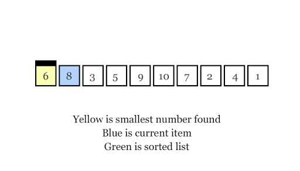

# Algoritmos de ordenamiento

Un algoritmo de ordenamiento (*sorting algorithm*) es un algoritmo que ubica los elementos de una lista en cierto orden, generalmente en un orden numérico o lexicográfico. Un ordenamiento eficiente es importante para optimizar otros algoritmos tales como los de búsqueda y combinación, que requieren que los datos de entrada estén ordenados. 

Aunque hay una gran cantidad de algoritmos de ordenamiento, en la práctica predominan unos pocos. Por ejemplo, ***insertion sort*** es ampliamente utilizado para ordenar conjuntos pequeños de datos, mientras que, para grandes conjuntos de datos se suelen utilizar ***heapsort***, ***mergesort*** o ***quicksort***. Además, a pesar de ser raramente utilizado en la práctica, ***buble sort*** se suele utilizar en la enseñanza.

| **Nombre**     | **Best** | **Average** | **Worst** | **Memory** |
| -------------- | -------- | ----------- | --------- | ---------- |
| Heapsort       | n log(n) | n log(n)    | n log(n)  | 1          |
| Mergesort      | n log(n) | n log(n)    | n log(n)  | n          |
| Quicksort      | n log(n) | n log(n)    | n^2^      | log(n)     |
| Insertion sort | n        | n^2^        | n^2^      | 1          |
| Bubble sort    | n        | n^2^        | n^2^      | 1          |
| Selection sort | n^2^     | n^2^        | n^2^      | 1          |

Las implementaciones más eficientes generalmente utilizan algoritmos híbridos, por ejemplo, el algoritmo ***Timsort*** combina *merge sort* con *insertion sort* y es utilizado en varios lenguajes de programación como Python, Java, Swift y Rust. Mientras que el algoritmo ***Introsort***, el cual es utilizado en algunas implementaciones de C++ y .NET, combina *quicksort* y *heapsort*.

---

## Bubble sort

En el ordenamiento por burbuja, se compara cada elemento de la lista con el siguiente, intercambiándolos de posición si están en el orden equivocado. Esto hace que sea necesario recorrer varias veces la lista entera hasta ordenarla por completo. No se recomienda su uso en ningún escenario debido a lo ineficiente que es.

~~~java
// Se recorre la lista completa varias veces.
// Se compara cada elemento con el siguiente.
// Si es mayor, se intercambian de posición.
public static void bubblesort(int[] array) {
    int n = array.length;
    for (int i=0; i<n; i++) {
        for (int j=0; j<(n-1); j++) {
            if (array[j] > array[j+1]) {
                int aux = array[j];
                array[j] = array[j+1];
                array[j+1] = aux;
            }
        }
    }
}
~~~

## Selection sort

Este algoritmo mejora ligeramente el *bubble sort*, ya que requiere muchas menos operaciones de intercambio, aunque la mejora no es muy sustancial. Funciona buscando el mínimo elemento de la lista, lo intercambia con el primero, luego busca el siguiente mínimo en el resto de la lista y lo intercambia con el segundo, hasta llegar al final de la lista.

~~~java
// A medida que se recorre la lista, se comparan
// los valores posteriores con el actual hasta hallar
// el mínimo, en cuyo caso se realiza el intercambio.
public static void selectionsort(int[] array) {
    for (int i=0; i<array.length; i++) {
        int min = i;
        for (int j=i+1; j<array.length; j++) 
            if (array[j] < array[min]) 
                min = j;   
        int temp = array[i];
        array[i] = array[min];
        array[min] = temp;
    }
}
~~~

## Insertion sort

Este algoritmo funciona tomando el primer elemento y tratándolo como un conjunto ordenado, luego cuando hay *k* elementos ordenados de menor a mayor, se toma el siguiente elemento *k+1* y se compara con todos los elementos ya ordenados, deteniéndose cuando se encuentra un elemento menor (*todos los elementos mayores han sido desplazados una posición a la derecha*) o cuando ya no se encuentran elementos (*todos los elementos fueron desplazados y este es el más pequeño*).

~~~java
// A medida que se recorre la lista, se compara el
// elemento actual con los anteriores. Mientras los 
// demás valores sean mayores que el elemento actual,
// se desplazan hacia la derecha hasta que se halle
// un número más pequeño, en cuyo caso se realiza el
// intercambio con el valor actual.
public static void insertionsort(int[] array) {
    for (int i=1; i<array.length; i++) {
        int current = array[i];
        int j = i;
        while (j > 0 && current < array[j-1]) {
            array[j] = array[j-1];
            j--;
        }
        array[j] = current;
    }
}
~~~

## Shellsort

Este algoritmo es una generalización del ordenamiento por inserción

## Heapsort

Es el más lento de los algoritmos de orden *O(n log(n))*, pero a diferencia de *mergesort* y *quicksort*, este no requiere una recursión masiva ni múltiples arreglos para trabajar.

Un montículo (*heap*) es un árbol binario ordenado. Existen dos tipos:

-   **Max heap**: cuando el padre es mayor que los hijos.
-   **Min heap**: cuando el padre es menor que los hijos.

1.  Create max heap.
2.  Remove largest item.
3.  Place item in sorted partition.

## Mergesort

El ordenamiento por mezcla es un algoritmo recursivo basado en la técnica *divide y vencerás*. Suele ser un poco más rápido que *heapsort* en grandes conjuntos de datos, pero requiere el doble de memoria. A pesar de esto, a menudo es la mejor opción para ordenar listas enlazadas.

Trabaja dividiendo la lista desordenada en dos mitades, luego ordena cada sublista de manera recursiva (*una lista de un solo elemento se considera ordenada*) aplicando el ordenamiento por mezcla y al final ambas sublistas se mezclan en una sola lista ordenada.

~~~java
// Primero divide la lista en dos mitades.
// Luego ordena la mitad izquierda y derecha recursivamente.
// Por último, mezlca ambas mitades ya ordenadas.
public static void mergesort(int[] array) {
    int n = array.length;
    if (n < 2)
        return;
    int mid = n / 2;
    int[] left = new int[mid];
    int[] right = new int[n - mid];
    for (int i=0; i<mid; i++)
        left[i] = array[i];
    for (int i=mid; i<n; i++)
        right[i - mid] = array[i];
     mergesort(left);
     mergesort(right);
     merge(array, left, right);
}

// Se mezclan las sublistas ordenadas izquierda y derecha.
// i : índice de la lista izquierda.
// j : índice de la lista derecha.
// k : índice de la lista ordenada.
private static void merge(int[] array, int[] left, int[] right) {
    int i = 0, j = 0, k= 0;
    while (i < left.length && j < right.length) {
        if (left[i] <= right[j])
            array[k++] = left[i++];
        else
            array[k++] = right[j++];
    }
    while (i < left.length) 
        array[k++] = left[i++];
    while (j < right.length)
        array[k++] = right[j++];
}
~~~

## Quicksort

Es considerado el más rápido algoritmo de ordenamiento de propósito general.

