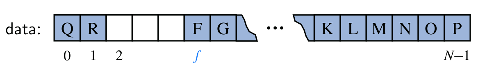

## Queue

Una cola (*Queue*) es una colección de objetos que son añadidos y removidos de acuerdo al principio **FIFO** (*First-In, First-Out*), esto significa que el primer elemento en entrar a la fila, será también el primero en salir.

Se pude visualizar como una fila de personas que esperan a entrar a un banco. En este caso, las personas llegan y se acomodan al final de la cola, mientras que los que están al frente son los primeros en ser atendidos.

Los principales métodos de una cola son:

| **Método**           | **Descripción**                                  |
| -------------------- | ------------------------------------------------ |
| `.push(Object data)` | Añade un elemento al final de la cola.           |
| `.pop()`             | Retorna y elimina el primer elemento de la cola. |
| `.first()`           | Consulta el primer elemento de la cola.          |
| `.size()`            | Retorna el número de elementos de la cola.       |
| `.isEmpty()`         | Evalúa si la cola está vacía.                    |

Las colas pueden ser implementadas utilizando un arreglo (*tamaño estático*) o una lista enlazada (*tamaño dinámico*).

---

### Cola basada en un arreglo

La clase `Queue` tiene un campo `items` que corresponde al arreglo que almacenará los datos y cuyo tamaño está definido por el parámetro del método constructor. El campo `firstIndex` es el índice del primer elemento de la cola y `length` es el número de elementos de la cola, que es diferente al tamaño del arreglo.

~~~java
// Cola implementada a partir de un arreglo.
public class Queue {
    private Object[] items;
    private int firstIndex;
    private int length;
    
    public Cola(int capacity) {
        this.items = new Object[capacity];
        this.firstIndex = 0;
        this.length = 0;
    }
    
    // other methods...
}
~~~

Con esta implementación, a medida que eliminamos y añadimos elementos, la parte delantera de la cola se desplaza hacia adelante y debido a que se tiene una capacidad límite, eventualmente la parte trasera se desbordará, saltando de nuevo a la primera posición del arreglo.

Para insertar un elemento al final de la lista se debe calcular el siguiente índice dentro del arreglo, esto se calcula con la fórmula `nextIndex = (firstIndex + length) % data.length`. Por ejemplo, si se tiene un arreglo de tamaño `10`, con `3` elementos y el primer elemento en el íncide `5`, sus tres elementos se almacenan en los índices `5, 6, 7` y el siguiente se ubicará en el índice `8`, ya que `8 = (5 + 3) % 10`. Pero, si la cola tiene capacidad `10` con tres elementos y el primer elemento en el índide `8`, sus tres elementos se guardarán en los índices `8, 9, 10` y el siguiente se ubicará en el índice `1`, ya que `1 = (8 + 3) % 10`.

~~~java
// Inserta un elemento al final de la cola.
public void push(Object data) {
    if (this.length == items.length)
        throw new IllegalStateException("Queue is full!");
    int nextIndex = (firstIndex + this.length) % items.length;
    set[nextIndex] = data;
    length++;
}
~~~

De manera similar, cuando se elimina el primer elemento de la cola, el índice del nuevo primer elemento se calcula con la fórmula `firstIndex = (firstIndex + 1) % data.length`.

~~~java
// Retorna y elimina el primer elemento de la cola.
public Object pop() {
    if (this.isEmpty())
        return null;
    Object element = items[firstIndex];
    items[firstIndex] = null;
    firstIndex = (firstIndex + 1) % items.length;
    length--;
    return element;
}
~~~

Los demás métodos tienen una fácil implementacioń y se muestran a continuación.

~~~java
// Evalúa si la cola está vacía.
public boolean isEmpty() {
    return (length == 0);
}
    
// Retorna el tamaño de la cola.
public int size() {
    return length;
}
        
// Consulta el primer elemento de la cola.
public Object first() {
    if (this.isEmpty())
        return null;
    return set[firstIndex];
}
    
@Override
public String toString() {
    String result = "[ ";
    for (int i=0; i<this.size(); i++) {
        result += items[firstIndex] + " ";
        firstIndex = (firstIndex + 1) % items.length;
    }
    return (result += "]");
}
~~~

---

### Cola a partir de una lista enlazada

Al utilizar una lista enlazada, permitimos que la cola no tenga un límite de capacidad. Para esto hacemos uso de una clase `Node` que representará cada elemento de la cola, y una clase `Queue` que representa la fila como tal.

~~~java
class Node {
    public Object data;
    public Node next;
    
    public Node(Object data) {
        this.data = data;
        this.next = null;
    }
    
    @Override
    public String toString() {
        return String.valueOf(data);
    }
}
~~~

~~~java
// Implementación de una cola a partir de una lista enlazada.
public class Queue {
    private Node head;
    private Node tail;
    private int length;
    
    public Queue() {
        this.head = null;
        this.tail = null;
        this.length = 0;
    }
    
    // other methods...
}  
~~~

Para añadir un elemento al final de la cola, se crea el nodo correspondiente. Si la cola está vacía, asigna dicho nodo como primer elemento. Si no, se indica que después del último elemento siga dicho nodo y se establece el nodo como último elemento.

~~~java
// Añade un elemento al final de la cola.
public void push(Object data) {
    Node newNode = new Node(data);
    if (this.isEmpty()) 
        head = newNode;
    else 
        tail.next = newNode;
    tail = newNode;
    length++;
}
~~~

Para retornar y eliminar el primer elemento de la cola, se crea un nodo correspondiente al primer elemento, luego se establece como cabeza al segundo elemento de la fila y se disminuye la longitud en uno.

~~~java
// Retorna y elimina el primer elemento de la cola.
public Node pop() {  
    Node removed = head;
    if (head == tail) {
        head = null;
        tail = null;
    }
    else
        head = head.next;
    length--;
    return removed;
}
~~~

Los demás métodos son muy simples. A continuación su implementación:

~~~java
// Evalúa si la cola está vacía.
public boolean isEmpty() {
    return (head == null && tail == null);
}
    
// Retorna el tamaño de la cola.
public int size() {
    return length;
}
    
// Retorna el primer elemento de la cola.
public Object first() {
    return head;
}    
    
@Override
public String toString() {
    String result = "[";
    Node aux = head;
    while (aux != null) {
        result += aux;
        if (aux.next != null)
            result += ", ";
        aux = aux.next;
    }
    return result + "]";
}
~~~

---

### Cola circular

En este caso, el primer y último elemento de la cola están unidos. Para implementarlo, simplemente hacemos un pequeño cambio en los métodos `.push(Object data)` y `.pop()` de la cola anteriormente creada.

~~~java
// Añade un elemento al final de la cola circular.
public void push(Object data) {
    Node newNode = new Node(data);
    if (this.isEmpty()) 
        head = newNode;
    else 
        tail.next = newNode;
    newNode.next = head;
    tail = newNode;
    length++;
}
~~~

~~~java
// Elimina el primer elemento de la cola circular.
public Node pop() { 
    Node removed = head;
    if (head == tail) {
        head = null;
        tail = null;
    }
    else {
        head = head.next;
        tail.next = head;
    }
    length--;
    return removed;
}
~~~

---

### Cola de prioridad

En este caso, se modela cada elemento y su prioridad como un par *clave-valor* que en conjunto se denominan *entrada* (*clave: prioridad; valor: elemento*). Los principales métodos una cola de prioridad son:

| **Método**            | **Descripción**                                      |
| --------------------- | ---------------------------------------------------- |
| `.insert(key, value)` | Añade una entrada a la cola.                         |
| `.min()`              | Retorna la entrada con la menor prioridad.           |
| `.removeMin()`        | Retorna y elimina la entrada con la menor prioridad. |
| `.size()`             | Retorna el número de elementos de la cola.           |
| `.isEmpty()`          | Evalúa si la cola está vacía.                        |

Una cola de prioridad puede tene múltiples entradas con la misma prioridad, en cuyo caso, los métodos `.min()` y `.removeMin()` retornarán una entrada arbitaria entre las de menor prioridad.

